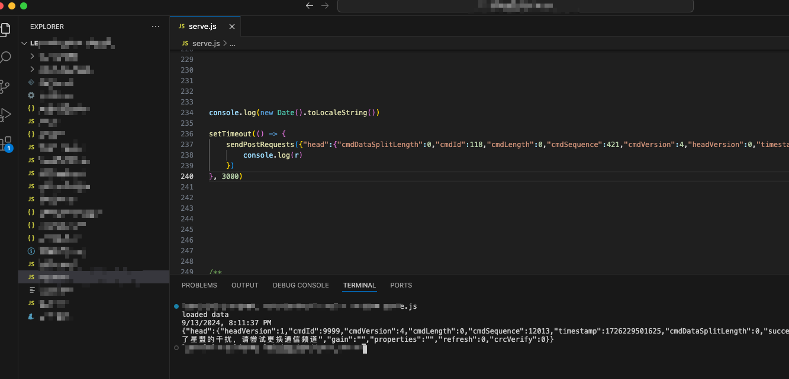
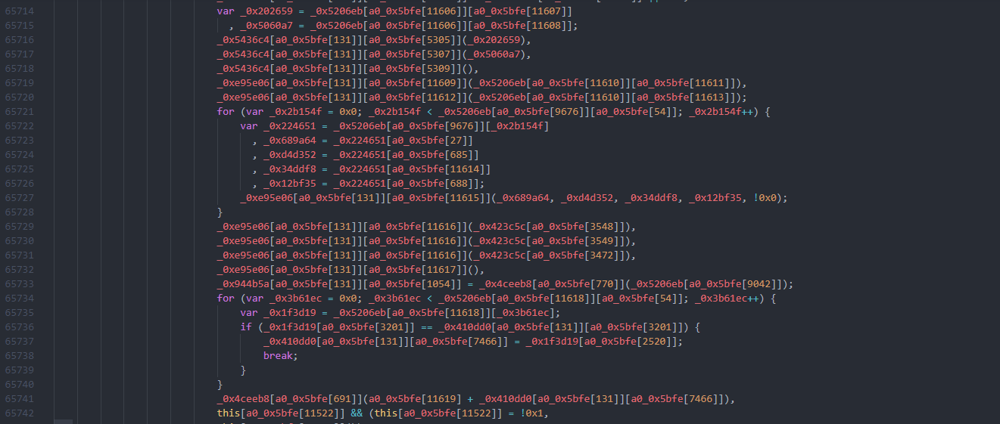
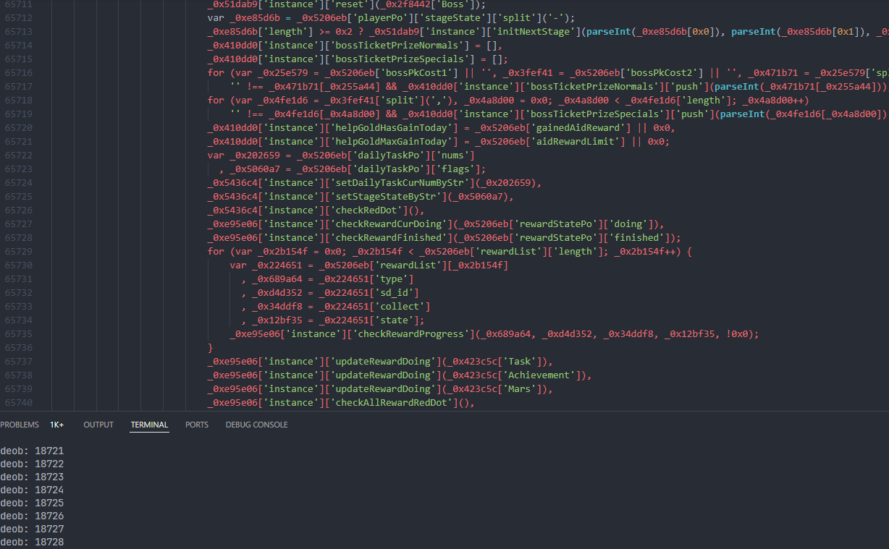

## ^1.0.8

久等，^1.0.8版本算法已经升级，该版本相较上版本的算法算得上是巨大的改变。

**该版本后的加解密算法将不再开源，以防商用。**

### 演示



### 简单说说流程

现版本算法经过了ob混淆处理，刚入门的同学不建议上手，会头疼的。

1. 混淆解密(看情况，我是做了反混淆的，看着相对来说清晰一点)
2. 扣算法
3. 现版本算法是需要^node 18环境的，或者转到c代码后编译为dll调用


#### 混淆后的代码


#### 反混淆后的代码




该脚本仅供测试使用，请勿用于商业用途。

该脚本仅供测试使用，请勿用于商业用途。

该脚本仅供测试使用，请勿用于商业用途。


### 如何使用

#### Node

```javascript
const ltzj = require('./leitingzhanji');
// 加密
ltzj.encrypt(json_payload, cmdSequence);
// 解密
ltzj.decrypt(result_buffer);
```


### Node 例子

```javascript
import axios from 'axios';
const ltzj = require('./leitingzhanji');

const url = 'https://wxmini.jj5agame.com/p.f';
const json_payload = {
    head: {
        cmdDataSplitLength: 0,
        cmdId: 96,
        cmdLength: 0,
        cmdSequence: 179, // 该值需要与加密函数传入的cmdSequence值保持一致
        cmdVersion: 4,
        headVersion: 0,
        timestamp: Math.floor(Date.now()),
        crcVerify: 0,
        platform: 0,
        reconnect: false,
        sid,  // sid
        uid  // uid
    },
    id: 1
}
let payload = ltzj.encrypt(json_payload, 179)
const result = await axios({
    method: 'POST',
    url: url,
    data: payload,
    headers: headers,
    responseType: 'arraybuffer'
});
// 返回结果
console.log(ltzj.decrypt(result.data));
```